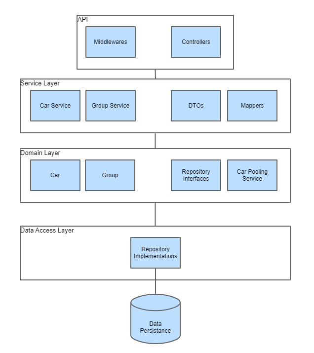
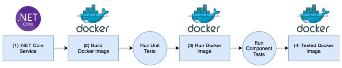

# Car Pooling Service Challenge

Design/implement a system to manage car pooling.

At Cabify we provide the service of taking people from point A to point B.
So far we have done it without sharing cars with multiple groups of people.
This is an opportunity to optimize the use of resources by introducing car
pooling.

You have been assigned to build the car availability service that will be used
to track the available seats in cars.

Cars have a different amount of seats available, they can accommodate groups of
up to 4, 5 or 6 people.

People requests cars in groups of 1 to 6. People in the same group want to ride
on the same car. You can take any group at any car that has enough empty seats
for them. If it's not possible to accommodate them, they're willing to wait until 
there's a car available for them. Once a car is available for a group
that is waiting, they should ride. 

Once they get a car assigned, they will journey until the drop off, you cannot
ask them to take another car (i.e. you cannot swap them to another car to
make space for another group). In terms of fairness of trip order: groups are
served in the order they arrive, but they ride opportunistically.

For example: a group of 6 is waiting for a car and there are 4 empty seats at
a car for 6; if a group of 2 requests a car you may take them in the car for
6 but only if you have nowhere else to make them ride. This may mean that the
group of 6 waits a long time, possibly until they become frustrated and
leave.

## Evaluation rules

This challenge has a partially automated scoring system. This means that before
it is seen by the evaluators, it needs to pass a series of automated checks
and scoring.

### Checks

All checks need to pass in order for the challenge to be reviewed.

- The `acceptance` test step in the `.gitlab-ci.yml` must pass in master before you
submit your solution. We will not accept any solutions that do not pass or omit
this step. This is a public check that can be used to assert that other tests 
will run successfully on your solution. **This step needs to run without 
modification**
- _"further tests"_ will be used to prove that the solution works correctly. 
These are not visible to you as a candidate and will be run once you submit 
the solution

### Scoring

There is a number of scoring systems being run on your solution after it is 
submitted. It is ok if these do not pass, but they add information for the
reviewers.

## API

To simplify the challenge and remove language restrictions, this service must
provide a REST API which will be used to interact with it.

This API must comply with the following contract:

### GET /status

Indicate the service has started up correctly and is ready to accept requests.

Responses:

* **200 OK** When the service is ready to receive requests.

### PUT /cars

Load the list of available cars in the service and remove all previous data
(existing journeys and cars). This method may be called more than once during 
the life cycle of the service.

**Body** _required_ The list of cars to load.

**Content Type** `application/json`

Sample:

```json
[
  {
    "id": 1,
    "seats": 4
  },
  {
    "id": 2,
    "seats": 6
  }
]
```

Responses:

* **200 OK** When the list is registered correctly.
* **400 Bad Request** When there is a failure in the request format, expected
  headers, or the payload can't be unmarshalled.

### POST /journey

A group of people requests to perform a journey.

**Body** _required_ The group of people that wants to perform the journey

**Content Type** `application/json`

Sample:

```json
{
  "id": 1,
  "people": 4
}
```

Responses:

* **200 OK** or **202 Accepted** When the group is registered correctly
* **400 Bad Request** When there is a failure in the request format or the
  payload can't be unmarshalled.

### POST /dropoff

A group of people requests to be dropped off. Whether they traveled or not.

**Body** _required_ A form with the group ID, such that `ID=X`

**Content Type** `application/x-www-form-urlencoded`

Responses:

* **200 OK** or **204 No Content** When the group is unregistered correctly.
* **404 Not Found** When the group is not to be found.
* **400 Bad Request** When there is a failure in the request format or the
  payload can't be unmarshalled.

### POST /locate

Given a group ID such that `ID=X`, return the car the group is traveling
with, or no car if they are still waiting to be served.

**Body** _required_ A url encoded form with the group ID such that `ID=X`

**Content Type** `application/x-www-form-urlencoded`

**Accept** `application/json`

Responses:

* **200 OK** With the car as the payload when the group is assigned to a car.
* **204 No Content** When the group is waiting to be assigned to a car.
* **404 Not Found** When the group is not to be found.
* **400 Bad Request** When there is a failure in the request format or the
  payload can't be unmarshalled.

## Tooling

At Cabify, we use Gitlab and Gitlab CI for our backend development work. 
In this repo you may find a [.gitlab-ci.yml](./.gitlab-ci.yml) file which
contains some tooling that would simplify the setup and testing of the
deliverable. This testing can be enabled by simply uncommenting the final
acceptance stage. Note that the image build should be reproducible within
the CI environment.

Additionally, you will find a basic Dockerfile which you could use a
baseline, be sure to modify it as much as needed, but keep the exposed port
as is to simplify the testing.

You are free to modify the repository as much as necessary to include or remove
dependencies, but please document these decisions using MRs or in this very
README adding sections to it, the same way you would be generating
documentation for any other deliverable. We want to see how you operate in a
quasi real work environment.

:warning: Avoid dependencies and tools that would require changes to the 
`acceptance` step of [.gitlab-ci.yml](./.gitlab-ci.yml), such as 
`docker-compose`

:warning: The challenge needs to be self-contained so we can evaluate it. 
If the language you are using has limitations that block you from solving this 
challenge without using a database, please document your reasoning in the 
readme and use an embedded one such as sqlite.

You are free to use whatever programming language you deem is best to solve the
problem but please bear in mind we want to see your best!

You can ignore the Gitlab warning "Cabify Challenge has exceeded its pipeline 
minutes quota," it will not affect your test or the ability to run pipelines on
Gitlab.

# About decisions
Solve this problem has let me to take decisions. This section is about the main 
decisions that I made. I think this is a good way to know how to approach this 
solution.

## Why an API First Approach?
The first decission that I ahve made is take an API First Approach. I started 
creating a Open API/Swagger specification file for the api: 
[car-pooling.yml](./car-pooling.yml). These are the reasons:
1. **Formalize the API described in this readme.**  This readme establishes the
 way 
to communicate with the API, with Swagger yml I have a way to encode the API
 rules.
2. **Consistency.** The code developed is force to follow the rules.
3. **Parallel work.** If there was a frontend team, the frontend and backend can
 work in parallel.
4. **Testing.** There are tools on the market that allow mock the API and test it.
For example: <https://app.swaggerhub.com/help/integrations/api-auto-mocking>
4. **Reduce Risk on Failure.** The risk is reduced by ensuring the API are
 relaible and consistent for developers.

 ## Why not Authentication?
 I do not implement any authentication method on this solutions, mainly for two
  reasons:
 1. **Avoid on readme contract.** The API specification section do not talk about
  authentication, then the API contract should not implement it.
 2. **Cabify acceptance test.** Related to previous, I thhought that if the API
  specification do not talk about authentication then the acceptance test will
   fail when I return a 401 or 403 status code.

 ### How would I implement it?
 Initially I proposed two options: OAuth 2.0 with JWT or an API-Key. I would 
 choose JWT because I see the use of this API in an application with users, every
 user can journey with a trip, dropoff and locate, ergo a user represent a group
  in the API. OAuth with JWT serve two purposes that fit that scecnario:
  - **User authentication.** Securely verify that the calling user is who they claim to be.
  - **User authorization.** Check whether the user should have access to make this request.

## Why .NET Core?
The API implementation has been done with ASP.NET Core. Why?
1. **Previous experience.** I have experiencie making APIs with ASP.NET Core.
2. **[Open source](https://github.com/dotnet/aspnetcore).**
3. **Cross-platform.** You can develop and run on Windows, MacOS and Linux.
4. **Great for cloud solutions.** Easy to integrate with Azure and other cloud providers.

## Loose Coupling
A loose coupled components make an application easier to extend and maintain. I
have identified mainly 4 types of components: persistance components, business
components, use cases focused, communication components. I have approximated
these component with a naive Domain Drive Development architecture.



Thanks to this you can hold over where the data will persist and efforts can be focused on business logic development and use cases, making it easier to develop and test. 

## Why an ORM library (Entity Framework)?
I have implemented data layer using an Object-Relational Mapping library. This have two objetives:
1. **Decoupling for query languages.** Treat your data like objects.
2. **Easy to test.** You can easily mock your data access and test it.

I chose Entity Framework as ORM Library because:
1. **.NET Platform team maintenance.**
2. **[Open source.](https://github.com/dotnet/efcore#entity-framework-core)**
3. **In memory database option.** This is a good option for a self contained solution and for testing purposes.

## Why not CQRS?
The main reason: this is a very simple API and have enough decoupling. But with the naive DDD approach you could implement a simplified CQRS with one database in the future. How? CQRS means having two objects for a read/write operation where in other contexts there is one. With this you can split your models and create one for query and view models and other logical model with DDD patterns for the transactions. This simplification make your solution more decoupled and easy to extend in the future. 

I read about this simplification on this article <https://docs.microsoft.com/en-us/dotnet/architecture/microservices/microservice-ddd-cqrs-patterns/apply-simplified-microservice-cqrs-ddd-patterns>.

## Why not an Event-Sourcing solution?
I haven't had time to investigate how this scenario fits into [Event-Sourcing](https://martinfowler.com/eaaDev/EventSourcing.html)

## Why not a cache?
Solution modularity accepts a cache implementation for application layer services. However, this solution use an in memory storage, the cache implementation will not have a significant effect.

# Dockerized development environment
To make contributing easier, I dockerize the development environment. What do you need to start contributing:
- [Git client.](https://git-scm.com/)
- [Docker.](https://docs.docker.com/get-docker/)
- [VSCode.](https://code.visualstudio.com/)
  - [Remote-Containers plugin.](https://marketplace.visualstudio.com/items?itemName=ms-vscode-remote.remote-containers)

Thanks to VSCode with Remote-container plugin, vs code run a docker with the development environment, connect to the docker and run on it. When you launch the application via VSCode debugger, it maps the configured ports. More info: <https://code.visualstudio.com/docs/remote/containers>

Development enviroment configuration files:
- [Dockerfile.](./.devcontainer/Dockerfile)
- [devcontainer.json](./.devcontainer/devcontainer.json)

# CI Pipeline
I take advantage with the dockerfile to avoid artifacts. How it works?



On dockerfile:
1. Create a build stage on docker file.
2. Create a testrunner stage on dockerfile. This stage generate an image that run the unit tests.
3. Create the final stage on dockerfile.

On Gitlab CI yaml:
1. Build docker image with target on testrunner stage.
2. Run testrunner image.
3. Build docker publishing image.
4. Publish on registry.
5. Run docker.
6. Exec component or functional test.

I replace my functional tests execution with the cabify acceptance stage.